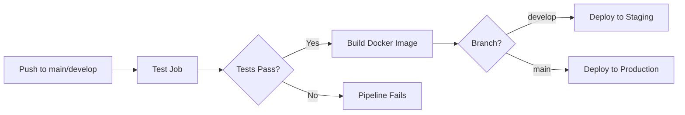
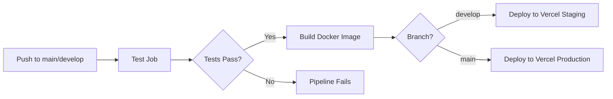

# CI/CD Pipeline Guide

## Current Pipeline Structure

### Why You Only See "Test" Jobs

The CI/CD pipelines are currently configured to **only run test jobs**. The build and deploy stages are commented out because they require credentials that haven't been set up yet:

1. **Docker Hub credentials** - for building and pushing container images
2. **Vercel credentials** - for deploying the frontend

### Current Active Jobs

#### Backend CI/CD (`backend-ci.yml`)
```
test (✅ Active)
├── Setup PostgreSQL & Redis
├── Install dependencies
├── Generate Prisma Client
├── Run linter
├── Run type check
├── Run migrations
├── Run unit tests
├── Run e2e tests
└── Upload coverage to Codecov

build (❌ Commented out - needs Docker Hub)
deploy-staging (❌ Commented out)
deploy-production (❌ Commented out)
```

#### Frontend CI/CD (`frontend-ci.yml`)
```
test (✅ Active)
├── Install dependencies
├── Run linter
├── Run type check
└── Build Next.js app

build (❌ Commented out - needs Docker Hub)
deploy-vercel-staging (❌ Commented out - needs Vercel)
deploy-vercel-production (❌ Commented out - needs Vercel)
```

## Full Pipeline Structure (When Enabled)

### Backend Pipeline Flow



**Jobs:**
1. **test** - Run all tests (unit + e2e)
2. **build** - Build Docker image and push to Docker Hub
3. **deploy-staging** - Deploy to staging environment (from `develop` branch)
4. **deploy-production** - Deploy to production (from `main` branch)

### Frontend Pipeline Flow



**Jobs:**
1. **test** - Run linter, type-check, and build
2. **build** - Build Docker image (optional, for self-hosted)
3. **deploy-vercel-staging** - Deploy to Vercel staging (from `develop` branch)
4. **deploy-vercel-production** - Deploy to Vercel production (from `main` branch)

## Required Secrets

To enable the full pipeline, you need to configure these secrets in GitHub:

### Docker Hub Secrets (for both pipelines)
- `DOCKER_USERNAME` - Your Docker Hub username
- `DOCKER_PASSWORD` - Your Docker Hub access token

### Vercel Secrets (for frontend)
- `VERCEL_TOKEN` - Your Vercel authentication token
- `VERCEL_ORG_ID` - Your Vercel organization/team ID
- `VERCEL_PROJECT_ID` - Your Vercel project ID

## How to Enable Build & Deploy

### Step 1: Set up Docker Hub

1. **Create Docker Hub account** (if you don't have one):
   ```bash
   # Visit: https://hub.docker.com/signup
   ```

2. **Create access token**:
   - Go to Account Settings → Security → New Access Token
   - Name it: `kinzen-ci-cd`
   - Save the token securely

3. **Add secrets to GitHub**:
   ```bash
   # Go to: https://github.com/Kinzen-dev/Kinzen/settings/secrets/actions
   # Add new repository secrets:
   DOCKER_USERNAME=your-dockerhub-username
   DOCKER_PASSWORD=your-access-token
   ```

### Step 2: Set up Vercel (Frontend Deployment)

1. **Create Vercel account**:
   ```bash
   # Visit: https://vercel.com/signup
   ```

2. **Install Vercel CLI locally**:
   ```bash
   npm install -g vercel
   ```

3. **Link your project**:
   ```bash
   cd frontend
   vercel login
   vercel link
   ```

4. **Get your credentials**:
   ```bash
   # After linking, find these in .vercel/project.json
   cat .vercel/project.json
   ```

5. **Create Vercel token**:
   - Go to: https://vercel.com/account/tokens
   - Create new token: `kinzen-ci-cd`

6. **Add secrets to GitHub**:
   ```bash
   # Add these secrets:
   VERCEL_TOKEN=your-vercel-token
   VERCEL_ORG_ID=team_xxxxx or user_xxxxx
   VERCEL_PROJECT_ID=prj_xxxxx
   ```

### Step 3: Enable the Jobs

Once you have all the secrets configured:

1. **For Backend** - Edit `.github/workflows/backend-ci.yml`:
   ```bash
   # Uncomment lines 106-169 (build and deploy jobs)
   ```

2. **For Frontend** - Edit `.github/workflows/frontend-ci.yml`:
   ```bash
   # Uncomment lines 56-133 (build and deploy jobs)
   ```

3. **Commit and push**:
   ```bash
   git add .github/workflows/
   git commit -m "chore: Enable build and deploy jobs"
   git push
   ```

## Testing the Pipeline

### Test Locally First

Before pushing to GitHub, test the builds locally:

```bash
# Backend - Build Docker image
cd backend
docker build -t kinzen-backend:test .

# Frontend - Build Docker image
cd frontend
docker build -t kinzen-frontend:test .

# Frontend - Test Vercel deployment
cd frontend
vercel --prod
```

### Watch the Pipeline

After pushing:
1. Go to: https://github.com/Kinzen-dev/Kinzen/actions
2. You should see ALL jobs running:
   - ✅ test
   - ✅ build (new!)
   - ✅ deploy-staging or deploy-production (new!)

## Environment-Specific Deployments

### Branch Strategy

- **`main` branch** → Production deployment
- **`develop` branch** → Staging deployment
- **Pull requests** → Only run tests (no deployment)

### Deployment Flow

```
Developer pushes code
    ↓
GitHub Actions triggered
    ↓
Run tests ✓
    ↓
Build Docker image ✓
    ↓
Push to Docker Hub ✓
    ↓
Deploy to environment ✓
```

## Current Status

| Component | Test | Build | Deploy Staging | Deploy Production |
|-----------|------|-------|---------------|-------------------|
| Backend   | ✅   | ❌    | ❌            | ❌                |
| Frontend  | ✅   | ❌    | ❌            | ❌                |

**Legend:**
- ✅ Active and working
- ❌ Commented out (needs credentials)

## Quick Enable Commands

### Option 1: Enable Docker Hub Deployment Only

```bash
# Set secrets in GitHub first, then:
cd /Users/triok.t/kinzen/portfolio

# Uncomment build jobs
sed -i '' 's/^  # build:/  build:/g' .github/workflows/backend-ci.yml
sed -i '' 's/^  #   /${SPACES}/g' .github/workflows/backend-ci.yml

git add .github/workflows/
git commit -m "chore: Enable Docker build jobs"
git push
```

### Option 2: Enable Full Deployment

This requires both Docker Hub AND Vercel credentials.

```bash
# After setting up all secrets:
cd /Users/triok.t/kinzen/portfolio

# Edit workflow files manually or use sed (be careful!)
# It's safer to uncomment manually in your editor

git add .github/workflows/
git commit -m "chore: Enable full CI/CD pipeline"
git push
```

## Troubleshooting

### "Invalid credentials" Error
- Double-check your Docker Hub / Vercel tokens
- Ensure secrets are named exactly as shown above
- Token permissions should include "Write" access

### Build Fails
- Test Docker builds locally first
- Check Dockerfile syntax
- Ensure all dependencies are in package.json

### Deployment Fails
- Verify environment variables in Vercel dashboard
- Check deployment logs in GitHub Actions
- Ensure API URLs are correct for each environment

## Next Steps

1. ✅ Fix e2e test errors (DONE)
2. 🔄 Set up Docker Hub account and credentials
3. 🔄 Set up Vercel account and credentials
4. 🔄 Enable build jobs
5. 🔄 Enable deployment jobs
6. 🔄 Test full pipeline end-to-end

## Notes

- The current "test-only" pipeline is intentional and safe
- All secrets are properly gitignored
- Never commit credentials to the repository
- Use GitHub's encrypted secrets feature for all sensitive data

